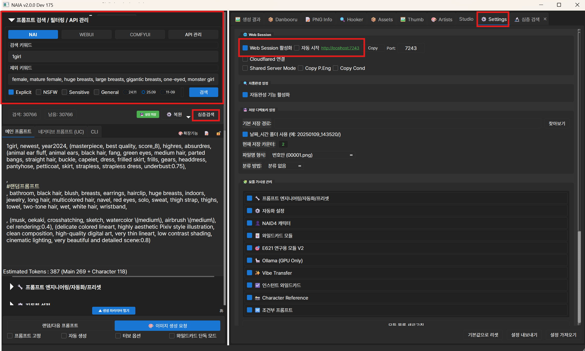
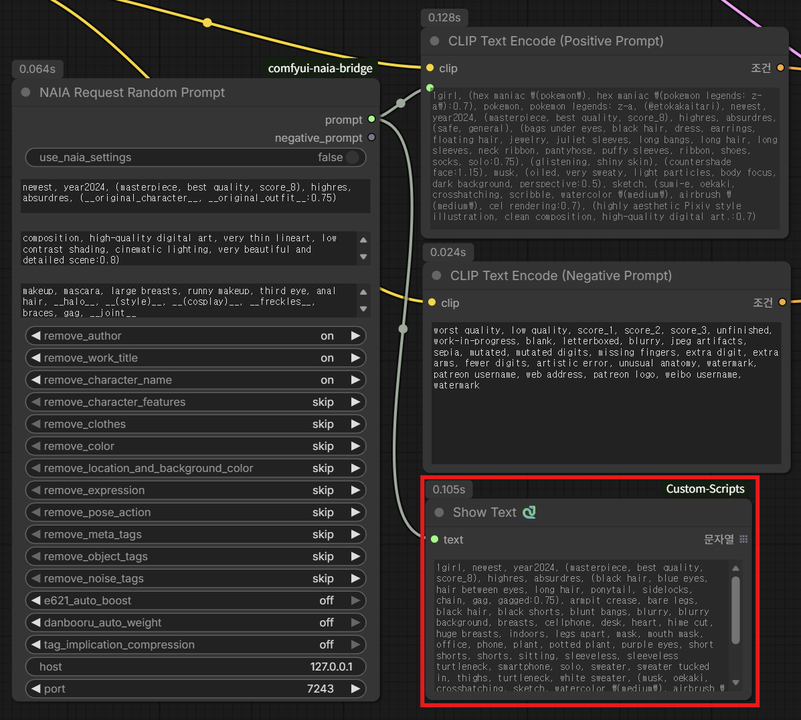

# ComfyUI NAIA 2.0 Bridge

ComfyUI 워크플로우에서 [NAIA 2.0](https://github.com/DNT-LAB/NAIA2.0)의 Remote Web API를 통해
프롬프트를 동기적으로 받아오거나 Prompt Engineering 설정을 override하는 커스텀 노드 패키지.

**Bridge ComfyUI workflows to NAIA 2.0's prompt generation engine via its Remote Web API.**

---

## ✨ 주요 기능 / Features

- ✅ NAIA의 랜덤 프롬프트 엔진을 ComfyUI에서 **동기적으로 호출** (request-response 매칭)
- ✅ ComfyUI 워크플로우 실행마다 NAIA가 새 프롬프트 생성 → CLIP Text Encode로 직결
- ✅ Prompt Engineering 설정 **per-request override** (NAIA 데스크톱 UI 불변)
- ✅ NAIA 자체 이미지 생성과 **병렬 작동** 가능 (`자동 생성` 체크 시)
- ✅ WebSocket 캐시를 통한 실시간 편집 상태 미러
- ✅ 연결 진단 및 에러 메시지 한국어 지원

---

## 📋 사전 요구사항 / Prerequisites

### 1. NAIA 2.0 (패치 적용 버전)
본 노드는 NAIA의 `core/remote_api_server.py` 에 **ComfyUI 전용 sync API 패치**가 적용되어 있어야 동작합니다.
- `POST /api/comfyui/random`
- `GET /api/comfyui/health`
- `peng_override` per-request 지원

NAIA 2.0 v2.x (해당 패치 포함 버전) 필요. NAIA Settings > Web Session 체크 또는 `--web-session` 플래그로 실행.

### 2. ComfyUI
- v0.3+ 권장 (frontend 1.42.14+ 권장, tooltip/placeholder 정상 렌더)

### 3. Python 의존성
```
websocket-client>=1.5
requests>=2.28
```
ComfyUI-Manager 사용 시 자동 설치됨.

---

## 🚀 설치 / Installation

### 방법 1: ComfyUI-Manager — "Install via Git URL" (권장)
1. ComfyUI-Manager 열기 (Manager 버튼)
2. **Install via Git URL** 버튼 클릭
3. 아래 URL 붙여넣기:
   ```
   https://github.com/DNT-LAB/comfyui-naia-bridge
   ```
4. Install 클릭 → 의존성 자동 설치 완료 후 ComfyUI **완전 재시작** (백엔드 + 브라우저 탭)

### 방법 2: 수동 설치 (git 직접 사용)
```bash
cd ComfyUI/custom_nodes
git clone https://github.com/DNT-LAB/comfyui-naia-bridge.git
cd comfyui-naia-bridge
pip install -r requirements.txt
```
ComfyUI 재시작.

### 업데이트 / Update
- **ComfyUI-Manager 사용 시**: Manager의 `Try Update` 또는 `Update All` 기능으로 최신 커밋 반영
- **수동 설치 시**:
  ```bash
  cd ComfyUI/custom_nodes/comfyui-naia-bridge
  git pull
  pip install -r requirements.txt
  ```

---

## 📖 사용법 / How to Use

### Step 1: NAIA 사전 설정



두 가지를 먼저 준비합니다.

**1-A. 검색 실행 (좌측 패널)**

NAIA의 랜덤 프롬프트는 **검색 결과 집합에서 무작위로 1개 row를 뽑아** 생성됩니다. 검색이 선행되지 않으면 요청 실패합니다.

- 검색 키워드 (예: `1girl`), 필요 시 제외 키워드 입력
- Rating 필터 체크 (Explicit / NSFW / Sensitive / General)
- 데이터셋 버전 선택 (25.09 권장)
- **검색** 버튼 클릭 → 하단에 `검색: N / 남음: N` 카운터가 0 이상이어야 함

**1-B. Web Session 활성화 (우측 Settings 탭)**

- **Web Session 활성화** 체크 → 브라우저에서 `http://localhost:7243` 접속 가능 확인
- **자동 시작** 체크 시 다음 NAIA 실행부터 자동 기동
- CLI 사용자: `python NAIA_cold_v4.py --web-session` 으로도 가능

---

### Step 2: ComfyUI 워크플로우 구성



1. 우클릭 → Add Node → `NAIA Bridge` → **NAIA Request Random Prompt**
2. 기본 설정: `use_naia_settings = true` (NAIA 데스크톱 UI 그대로 사용)
3. CLIP Text Encode 추가 (Positive용 1개면 충분)
4. **핵심**: CLIPTextEncode 의 `text` 위젯 우클릭 → **"위젯을 입력으로 변환"** (영어: `Convert Widget to Input`) — 이게 없으면 STRING 출력을 꽂을 수 없음
5. `NAIA Request Random Prompt` 의 `prompt` 슬롯을 Positive CLIPTextEncode 의 `text` 에 연결
6. 나머지는 표준 ComfyUI 파이프라인:
   ```
   Load Checkpoint ─ MODEL/CLIP/VAE
                      │
   NAIA Request Random Prompt ─ prompt ─→ CLIP Text Encode (Positive)
                                              │
   CLIP Text Encode (Negative, 직접 입력) ────┤
                                              ↓
                                           KSampler → VAE Decode → Save Image
   ```
7. **Queue Prompt** 실행 → 매번 NAIA가 새 랜덤 프롬프트 생성 → ComfyUI가 이미지 생성

#### ⚠️ Negative Prompt 연결은 선택사항 (기본: 연결 X)

`negative_prompt` 출력은 **기본적으로 연결하지 않는 것을 권장**합니다. 이유:

- NAIA의 negative_prompt 필드는 NAIA 메인 UI에서 사용자가 직접 입력한 고정 값
- 랜덤 요청이어도 이 값은 바뀌지 않음 → 매번 같은 negative를 받게 됨 (의미 X)
- ComfyUI 쪽의 Negative CLIP Text Encode에 **직접 원하는 negative prompt를 입력**하세요

**예외 — NAIA의 `Conditional Prompt` 모듈을 적극 활용하는 경우**: 이 모듈은 프롬프트 context에 따라 negative를 동적으로 변경합니다. 이 기능을 사용 중이라면 `negative_prompt` 출력을 Negative CLIP Text Encode 에 연결해 NAIA가 관리하는 negative를 받아 오세요.

#### 프리뷰 확인 (선택)

`Show Text` (ComfyUI-Custom-Scripts) 또는 rgthree 의 `Display String` 노드를
`prompt` 출력에 연결하면 NAIA가 보낸 원본 프롬프트를 확인할 수 있습니다.

---

## 📦 제공 노드 / Nodes

노드 메뉴: `Add Node → NAIA Bridge → ...`

### 1. `NAIA Request Random Prompt`  (메인 노드)
카테고리: `NAIA Bridge/API`

NAIA에 새 랜덤 프롬프트를 동기 요청. 20+ 입력 위젯으로 모든 기능 통합.

| 입력 | 기본값 | 설명 |
|---|---|---|
| `use_naia_settings` | `true` | `true`: NAIA 데스크톱 UI 그대로. `false`: 아래 위젯 값으로 override |
| `pre_prompt` | `""` | override 시 선행 프롬프트 |
| `post_prompt` | `""` | override 시 후행 프롬프트 |
| `auto_hide` | `""` | override 시 자동 숨김 태그 |
| `remove_author` ... 15종 | `skip` | 전처리 옵션 (skip/on/off) |
| `host` | `127.0.0.1` | NAIA 호스트 |
| `port` | `7243` | NAIA 포트 |

**출력**: `(prompt, negative_prompt)` — 문자열 2개. CLIP Text Encode에 연결 (아래 참고).

### 2. `NAIA Prompt Fetch (WebSocket)`
카테고리: `NAIA Bridge/Prompt`

NAIA 메인 UI 또는 Web Remote에서 **현재 편집/표시 중인** 프롬프트를 WS 캐시에서 가져옴. 랜덤 요청이 아니라 "지금 화면에 있는 값"을 미러.

### 3. `NAIA Read Prompt Engineering`
카테고리: `NAIA Bridge/Engineering`

NAIA의 Prompt Engineering 모듈 현재 상태 조회 (디버그/검토용). pre/post/auto_hide, 15종 전처리 JSON, 프리셋 목록 반환.

### 4. `NAIA Check Health`
카테고리: `NAIA Bridge/API`

NAIA 서버 연결 진단. **실패 시 raise 안 하고** `(ok=False, error_json)` 반환 → 조건부 게이팅 노드로 활용 가능.

---

## ⚠️ 알려진 동작 / Notes

- **`use_naia_settings = false` 의 all-or-nothing 규약**: override 시 pre/post/auto_hide/preprocessing 전부 노드 위젯 값으로 대체됨. 일부만 지정해도 나머지는 빈 값/OFF로 처리. 데스크톱 UI 값을 부분 사용하려면 `NAIA Read Prompt Engineering` 노드로 먼저 조회 후 위젯에 수동 복사.
- **`#` 주석 자동 제거**: NAIA 출력의 `#랜덤프롬프트` 같은 줄 단위 주석은 브리지가 제거 후 반환. NovelAI 이스케이프 syntax `#(...)` 는 보호됨.
- **첫 실행 시 ~3초 지연**: WS 초기 연결 + prompt_sync 수신 대기. 이후 요청은 <0.3초.
- **멀티 NAIA 인스턴스**: `(host, port)` 싱글턴 설계로 이론상 가능하나 충분한 테스트 미실시.

---

## 🧭 트러블슈팅 / Troubleshooting

### "NAIA 서버 연결 실패"
- NAIA 실행 중인지 확인
- Settings > Web Session 체크 또는 CLI `--web-session` 플래그 확인
- 포트 7243 (기본) 방화벽 차단 여부

### "prompt_sync 메시지를 7초 이내 받지 못했습니다"
- NAIA 메인 UI에서 프롬프트 편집 한 번 또는 랜덤 생성 한 번 실행
- Web Session 활성화 직후 최초 접속 시 발생 가능

### ComfyUI-Manager 설치 후 노드가 안 보임
- ComfyUI **완전 재시작** (백엔드 + 프론트엔드 브라우저 탭)
- `ComfyUI/custom_nodes/comfyui-naia-bridge/` 폴더 확인
- 콘솔 로그에서 import 에러 확인

### "Convert Widget to Input" 메뉴가 안 보임
- ComfyUI frontend 1.42.14+ 필요
- `python -m pip install -r ComfyUI/requirements.txt` 로 업데이트

---

## 📄 라이선스 / License

MIT License © 2026 DNT-LAB

이 노드는 NAIA 2.0 (GPL-3.0) 서버와 HTTP/WebSocket으로 통신합니다. GPL 전파 대상 아님 (loose coupling aggregation).

---

## 🙏 크레딧 / Credits

- **NAIA 2.0**: https://github.com/DNT-LAB/NAIA2.0
- **ComfyUI**: https://github.com/comfyanonymous/ComfyUI
